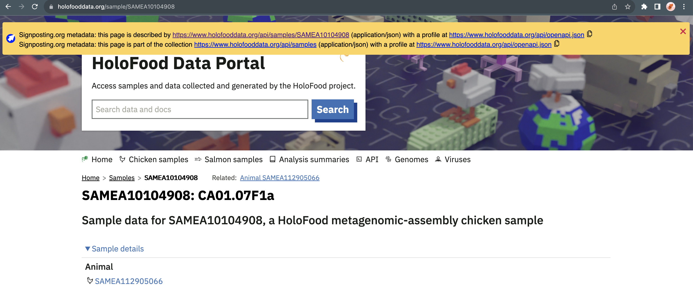

# Signposting.org browser extension

This Chrome browser extension sniffs for the presence of [signposting.org](https://signposting.org) headers in the HTTP headers (`Link: <http://my.data> rel="describedby"`) or HTML links (`<link href="my.data" rel="describedby/>`).

The presence of such headers is reported as a dismissible banner on the page.

The goal of signposting is to let robot clients navigate to metadata associated with a typically human-readable landing page for a dataset.
The goal of this browser extension is to make those robot-navigable links human-readable.

## Setup
* Clone this repository
* Open Chrome/Chromium/Chromium-based browsers
* Navigate to [chrome://extensions](chrome://extensions)
* Toggle on "Developer mode"
* "Load unpacked", and select the folder containing the repository
* Browse the scholarly web; e.g. try visiting [a sample on the HoloFood Data Portal](https://www.holofooddata.org/sample/SAMEA10104908) or [Stian Soiland-Reyes' test pages](https://s11.no/2022/a2a-fair-metrics/).

## Status
This extension is a PoC.

### Notable lacking features:

- support for Signposting in [Linksets](https://signposting.org/linkset/)
- warning of / deterministic resolution of clashing headers between HTTP and HTML
- test suite (perhaps running through [s11.no/2022/a2a-fair-metrics/](https://s11.no/2022/a2a-fair-metrics/)?)
- encapsulated CSS
- arguably unneccesary use of storage API; could be achieved with message handlers instead
- submission to [Chrome Web Store](https://developer.chrome.com/docs/extensions/)
- Firefox / Edge version
